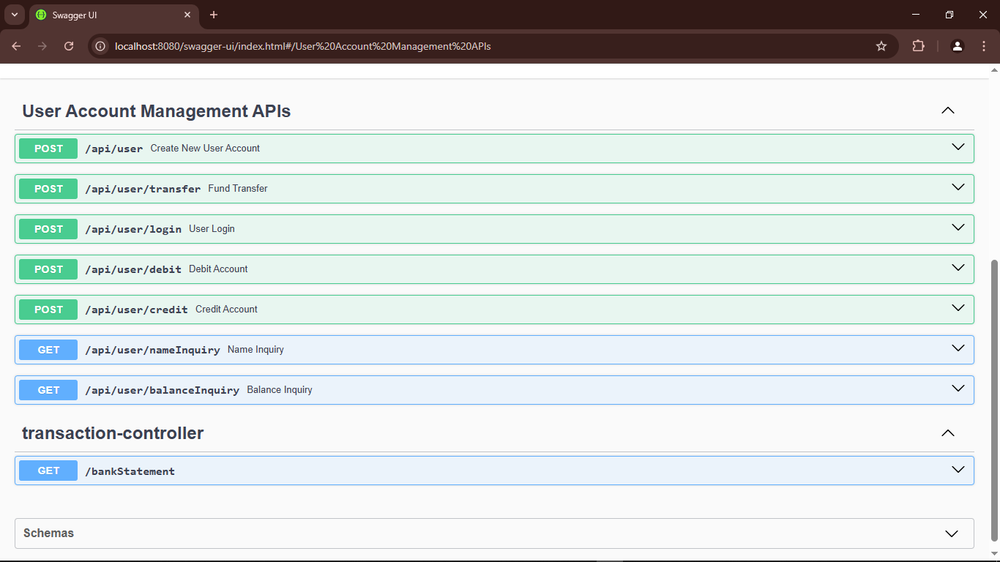
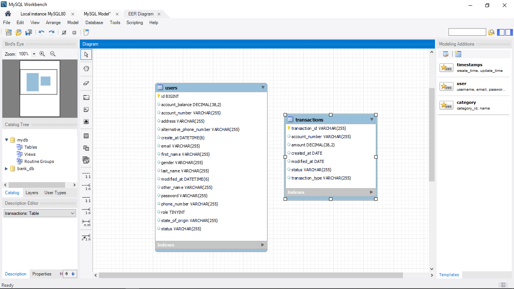
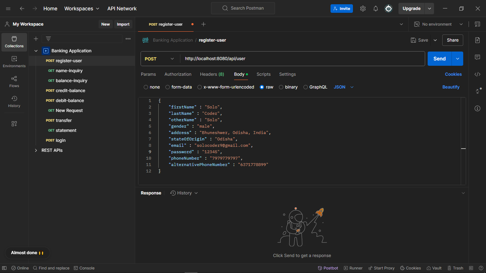
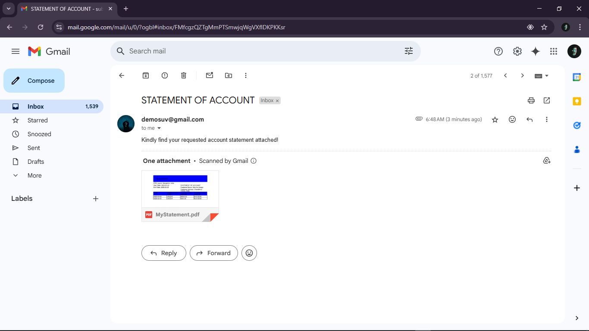
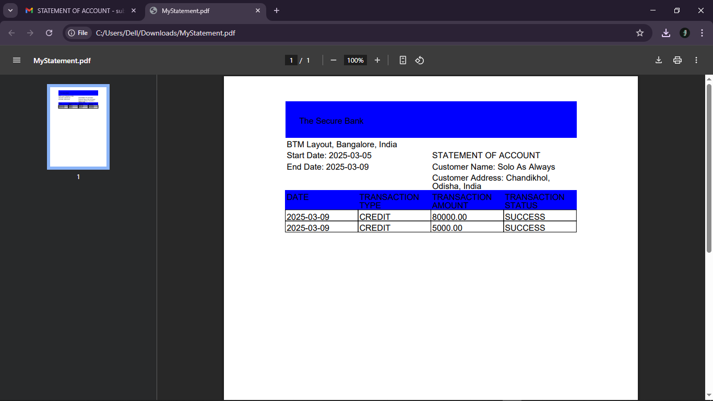
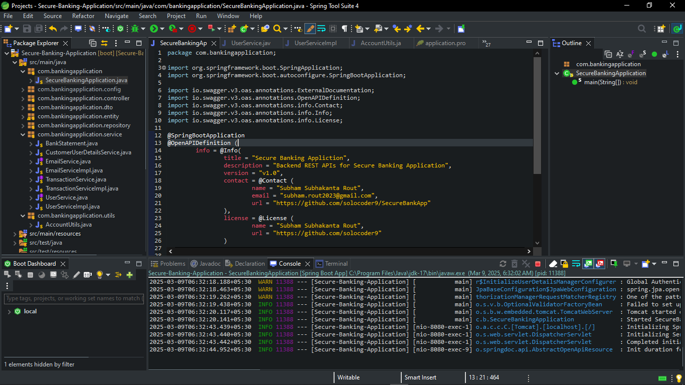

# 🏦 Secure Banking Application  
    

## 🚀 Overview  
Secure Banking Application is a **RESTful API-based banking system** built using **Spring Boot**. It provides essential banking functionalities such as **user account management, fund transfers, debit/credit operations, and balance inquiries** with a focus on **security and performance**.  

## ✨ Features
- 🔐 **User Registration & Authentication** - Secure login and registration.
- 💵 **Fund Transfers** - Transfer money between accounts securely.
- 💳 **Debit & Credit Transactions** - Perform withdrawals and deposits.
- 📈 **Bank Statements** - Retrieve transaction history.
- 👤 **User Balance Inquiry** - Check account balance anytime.
- 🛡️ **Security** - Built-in authentication and secure endpoints.
- 📜 **Swagger API Documentation** - Accessible at `/swagger-ui` 
- 📧 **Email Notifications** - Receive emails for user registration, fund transfers, and bank statements with a PDF attachment.

---

## 📱 API Endpoints  
🔹 **User Management**  
- `POST /api/user` → Register a new user (Sends a confirmation email)  
- `POST /api/user/login` → User login (JWT authentication)  

🔹 **Account Transactions**  
- `POST /api/user/transfer` → Transfer funds (Emails sent to sender & receiver)  
- `POST /api/user/debit` → Debit from account  
- `POST /api/user/credit` → Credit account  

🔹 **Account Inquiries**  
- `GET /api/user/nameInquiry` → Fetch user name  
- `GET /api/user/balanceInquiry` → Get account balance  
- `GET /bankStatement` → Get transaction history (Statement emailed with PDF attachment)  

---

## 🛠 Installation & Setup  

### 1️⃣ **Clone the Repository**  
```sh
git clone https://github.com/solocoder9/SecureBankApp.git
cd SecureBankApp
```

### 2️⃣ **Set Up the Database**  
Create a **MySQL database** named `secure_bank_db` and update `application.properties`:  
```properties
spring.datasource.url=jdbc:mysql://localhost:3306/secure_bank_db
spring.datasource.username=root
spring.datasource.password=yourpassword
spring.mail.host=smtp.gmail.com
spring.mail.port=587
spring.mail.username=your-email@gmail.com
spring.mail.password=your-email-password
spring.mail.properties.mail.smtp.auth=true
spring.mail.properties.mail.smtp.starttls.enable=true
```

### 3️⃣ **Build & Run the Application**  
```sh
mvn clean install
mvn spring-boot:run
```
The server will start at **http://localhost:8080**  

### 4️⃣ **Access API Documentation (Swagger UI)**  
📜 Open [http://localhost:8080/swagger-ui/](http://localhost:8080/swagger-ui/)  

---

## 🏠 Technologies Used  
- **Spring Boot 3.0** (Backend Framework)  
- **Spring Security & JWT** (Authentication & Authorization)  
- **Hibernate & JPA** (Database ORM)  
- **MySQL** (Relational Database)  
- **Swagger 3.0** (API Documentation)  
- **Lombok** (Reducing Boilerplate Code)  
- **JavaMail API** (Email Notifications)  
- **Apache PDFBox** (PDF Generation)  
- **Maven** (Build Automation)  

---

## 🖼 Recommended Screenshots  
🔹 **Swagger API Documentation** (`/swagger-ui`)  
  
🔹 **Database Schema (ER Diagram)**  

🔹 **Postman API Requests (Login, Transfer, Balance Inquiry)**  
  
🔹 **Email Notifications**  
    
🔹 **Statements PDF**  
 
🔹 **Application Running in STS**  
 

---

## 🔒 Security Measures  
✔ **JWT-based authentication** to secure API endpoints  
✔ **Role-based access control (RBAC)**  
✔ **Input validation & exception handling**  
✔ **Spring Security for request filtering**  
✔ **Email verification for account registration**  
✔ **Email alerts for fund transfers & statement generation**  

---

## 🚀 Future Enhancements  
🔹 Implement **Two-Factor Authentication (2FA)**  
🔹 Add **email/SMS notifications** for transactions  
🔹 Integrate **GraphQL API** for flexible queries  
🔹 UI Dashboard for user account management  
🔹 Implement **Scheduled Statements** (monthly auto-generated statements)  

---

## 🤝 Contributing  
Want to improve this project? Feel free to fork, create a pull request, or raise an issue!  

🔗 **GitHub Repository**: [SecureBankApp](https://github.com/solocoder9/SecureBankApp)  

💎 **Contact**: [Solo Coder](mailto:solocoder9@gmail.com)  

---

🎯 **If you like this project, don't forget to ⭐ star the repository!** 🚀

